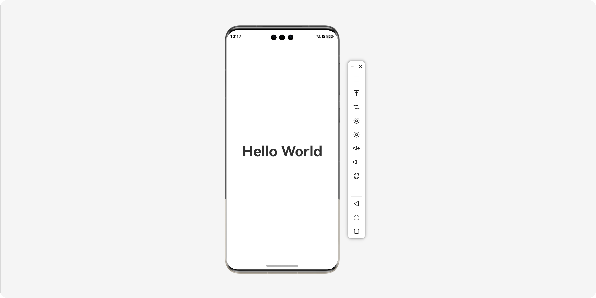
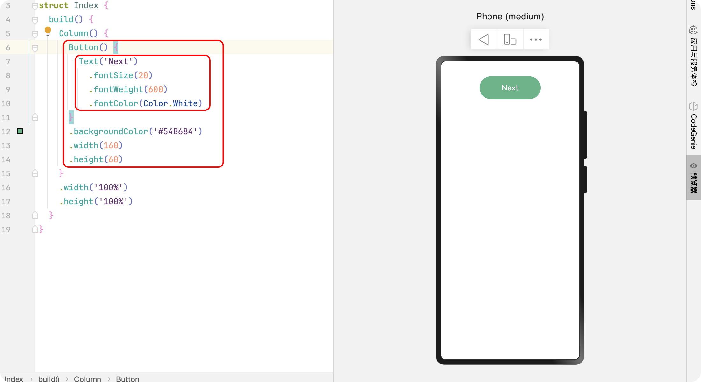
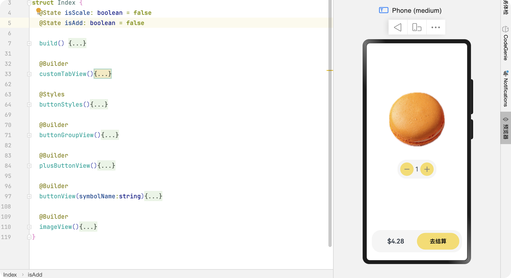
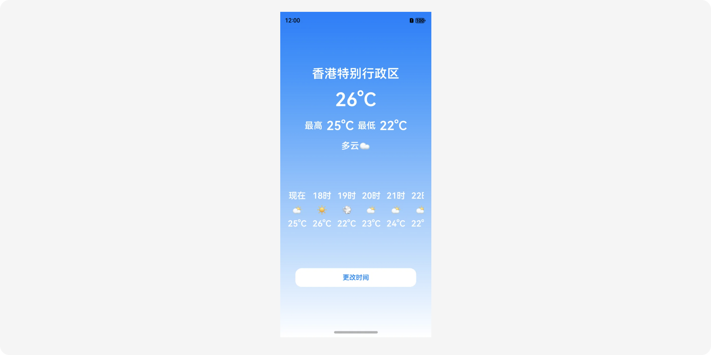
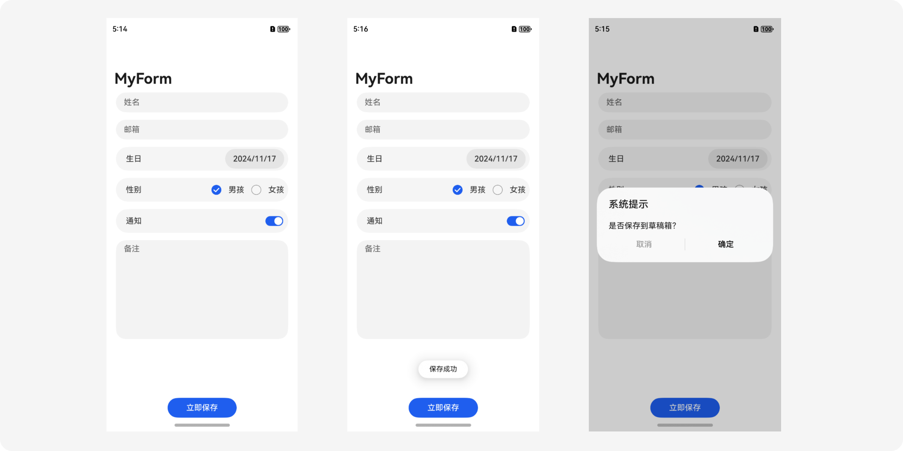
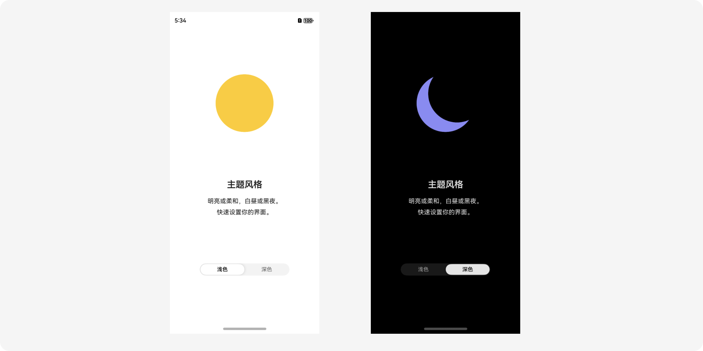
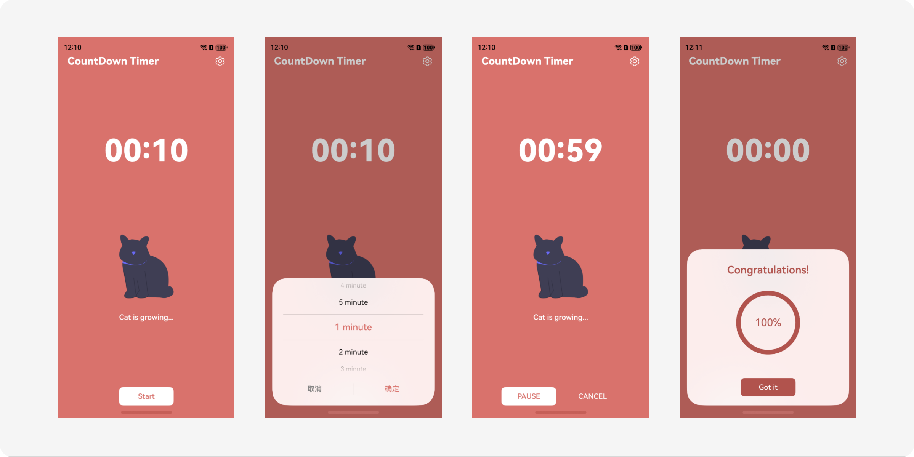
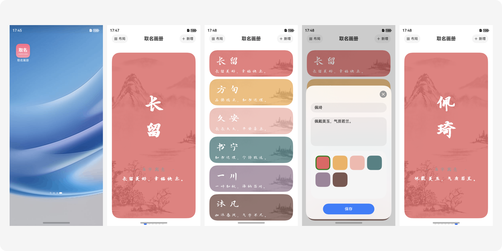

# HarmonyNEXT_Examples

HarmonyOS NEXT ArkUI Examples by LIZHIWEI

## Introduction

This project is written in ArkTS and ArkUI, aiming to help HarmonyOS NEXT developers learn and understand the full process of native HarmonyOS development. ❤️

## Screenshots

### Chapter 1

### Chapter 2

### Chapter 3
#### 本章内容主要是语法，这里就不展示了。

### Chapter 4

### Chapter 5

### Chapter 6

### Chapter 7

### Chapter 8

### Chapter 9

### Chapter 10

### Chapter 11

### Chapter 12

### Chapter 13

### Chapter 14

## Important information
For learning and sharing purposes only. Commercial use is not allowed without my permission.